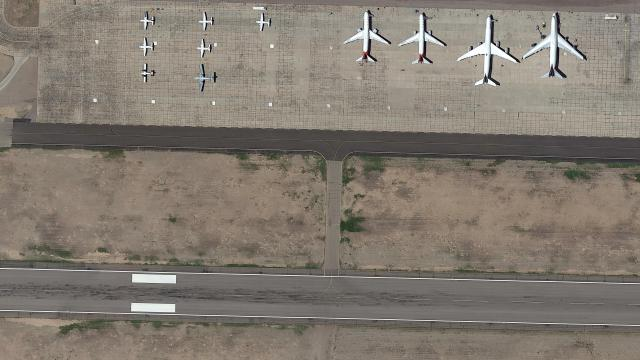
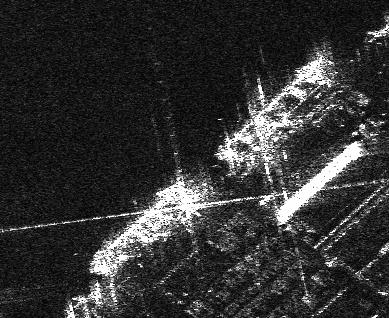

# Transformer Detection Pretrain Study

## Introduction
The goal of this blog post is to explore transformer pre-training methodologies on SAR object detection performance. Unfortunately I do not have 8 A100s at my disposal so quite a few decisions are made that decrease the effectiveness of the experiments performed. I will attempt to call these short falls out and how they would be addressed in a less constrained environment.
## Background: What is SAR imagery?

Imagine you want to take a picture of the ground from a satellite or airplane, but it's cloudy or dark. An ordinary camera (like the one in your phone, but much more powerful) wouldn't be able to see through the clouds or in the dark because it relies on visible light. This is where Synthetic Aperture Radar (SAR) comes in. Think of SAR as an image that is constructed off of radar pulses instead of light.
Here's a simple breakdown of how it works: (Graphic Below)
1. Send out a signal: Radar pulses are transmitted towards the Earth's surface.
2. Listen for the echo: These pulses bounce off everything they hit on the ground (buildings, trees, water, etc.) and some of the energy scatters back to the SAR antenna
Measure the echo (back-scatter):
    - How strong the back-scatter is: Different surfaces reflect the microwave pulses differently. Smooth surfaces like calm water tend to scatter the signal away, resulting in a weak echo (appearing dark in the image). Rough surfaces like a forest or buildings scatter more of the signal back, resulting in a strong echo (appearing bright).
    - How long it took the echo to return: This tells the system the distance to the object that the pulse bounced off of.
3. Create the "synthetic aperture": This is the clever part that gives SAR its name. Instead of needing a giant physical antenna to get high-resolution images, SAR uses the movement of the satellite or airplane. As the platform moves, it sends and receives multiple pulses from slightly different positions. By processing these signals together, it synthesizes the effect of a much larger antenna, allowing for finer detail in the image.
4. Build the image: By combining the information about the strength and timing of the back-scatter from all the pulses, the SAR system creates an image of the ground

### Challenges of Object Detection on SAR Imagery
The main issue with SAR object detection, as with all machine learning, is DATA. When you want to train a simple object detection model for a home security camera the process is pretty simple. Find a pre-trained model on the internet -> Find a labeled security camera dataset -> Finetune the model -> Done. The majority of what makes that process work so well does not exist for SAR imagery.
Object detection models are typically pre-trained extremely large labeled datasets. The Common Objects in Context dataset (COCO) consists of 330k images with over 1.5 million labels. These datasets help models learn generalizable features that are directly applicable to applications like security cameras and self driving. However these pre-trainings are much less applicable to overhead imagery as models trained on them do not perform well on optical satellite imagery. This leads us to our first research question. Does pre-training models on optical satellite images improve SAR object detection performance?

The overhead vs terrestrial imagery framing is far from the only difficulty of training on SAR images. SAR images are not simply grayscale satellite images, but are generated from radar pulses as described above. Below I have listed aspects of SAR imagery that make them particularly difficult.
- SAR images are inherently affected by speckle noise, a granular interference pattern that obscures fine details and makes distinguishing objects from surrounding clutter difficult. 
- The side-looking geometry of SAR acquisition leads to geometric distortions like layover (objects leaning towards the sensor), shadow (areas hidden from the radar beam), and foreshortening, which cause objects to appear warped or incomplete and their appearance to vary significantly based on viewing angle and topography. 
- SAR imagery is non-intuitive; the image intensity (back-scatter) reflects surface roughness, dielectric properties, and structural interactions with the microwave signal rather than familiar optical characteristics like color or texture, making visual interpretation and the development of robust features for detection less straightforward than with optical data. 

These factors combine to make objects in SAR images less visually consistent. Now we are at our second research question. To what extent will SAR image feature extractor pre-training effect model performance?
## Question 1: Does pre-training a model on optical overhead imagery (EO) improve performance?
### Experiment Setup:
In order to preform the experiments to answer this question we need an EO overhead imagery dataset, a SAR overhead imagery dataset, and an example detector architecture.

#### EO Overhead Imagery Data: HRPLANES v2 Dataset

HRPlanes (High Resolution Planes) dataset contains 2120 Very High Resolution (VHR) google earth images of airports from many different regions with various uses (civil/military/joint). There are a total of 14,335 labels in the dataset

#### SAR Overhead Imagery Data: SSDD 

SAR Ship Detection Dataset (SSDD) dataset contains 1,160 scenes with different resolutions, polarizations, sea conditions, large sea areas, and beaches. There are a total of 2,587 labels in the dataset

#### Object Detection Architechture: LWDETR

Light Weight DETR (LWDETR) is a simple 3 part architecture, encoder, projector, and detector. The encoder is a pre-trained ViT. The output the of the encoder is then compressed into a smaller latent vector using CNNs in the projector. This compressed latent space is then fed into the detector. The main reason that this architecture was chosen is because it employs the ViT encoder (otherwise would of used RT-DETR) and it is smaller enough to fit on my local machine. The version that I use is represented by part (a) of the figure above because we use ViT tiny instead of something like ViT-Large which would use the architecture in (b).

#### Experiment
Now it is time to test the research question. In order to do this we will train 3 models.

1. COCO pre-trained finetuned on SSDD
    - Sets our baseline performance
2. COCO pre-trained finetuned on HRPLANESv2
    - Hopefully provides the model context of overhead imagery
3. HRPLANESv2 finetuned on HRPLANESv2
    - If this model outperforms the fist model in the list then we will know that the pre-training had some effect

#### Results
Metrics: [learn more here](insert link to medium)
- mAP: Mean Average Precision 
- mAR: Mean Average Recall

| Pre-training | Finetuning | mAP | mAR |
|---|---|---|---|
| COCO | None | 0.0 | 0.0 |
| COCO | HRPlanes | 0.0 | 0.0 |
| COCO | SSDD | 0.737 | 0.794 |
| HRPlanes | SSDD |  |  |

#### Conclusion

## Question 2: How does SAR feature extractor pre-training improve object detection performance?
### Experiment Setup:

For this experiment, we are going to use a SWIN over the ViT backbone. This is because the SWIN backbone is supposed be more effective in data constrained problems. Learn more about them [here](insert medium article for swin)

### SimMIM Pre-training
In order to pre-train the SWIN backbones, we will use a process known as [SimMIM (Simple Masked Image Modeling)](https://github.com/microsoft/SimMIM). 

SimMIM  is a self-supervised learning method designed for pre-training transformer based vision models. 
The core idea is straightforward:
- Masking: Random patches of an input image are masked out.
- Prediction Task: The model is trained to predict the original, raw pixel values of these masked patches based on the visible parts of the image.
- Simple Design: SimMIM emphasizes simplicity by using random masking, directly regressing the raw pixel values (instead of predicting discrete tokens), and employing a lightweight prediction head (often just a linear layer). A simple L1 loss is commonly used to measure the difference between the predicted and ground truth pixel values in the masked regions.
The simplicity of the approach proves effective in learning visual representations from unlabeled data.

For this process we need 224x224 patches of SAR data. Ideally, this data would come from a different dataset, but in this case we are going to chip out the train set from the SSDD dataset.

Now that the 

### Results
Imagenet SWIN finetuned on SAR unfrozen
SIM-MIM SWIN finetuned on SAR unfrozen

### Conclusion
